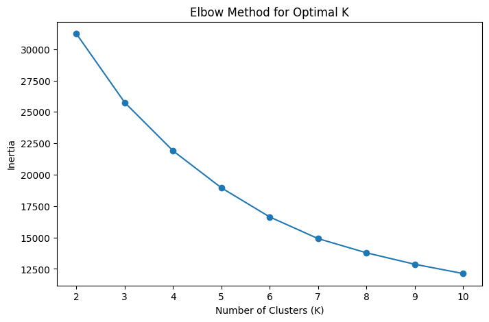
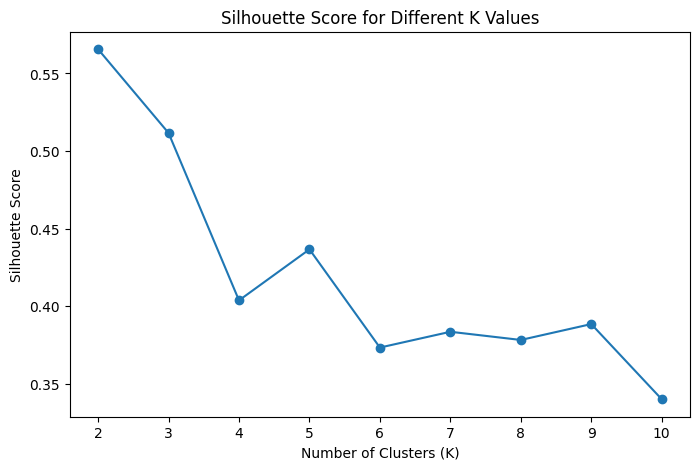
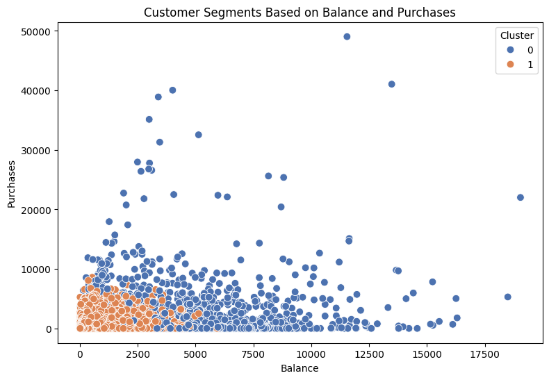

# Credit Card Customer Segmentation

A Machine Learning clustering project that segments credit card customers based on their financial behaviour using K-Means clustering.

## Problem Statement

Credit card customers have different spending, payment and credit usage patterns. Identifying groups of customers with similar financial behaviour can help financial institutions understand customer segments.

## Objective

The objective is to segment credit card customers into groups based on their financial behaviour using an unsupervised Machine Learning approach.

## Dataset

The dataset contains customer-level credit card usage and financial information such as balance, purchases, cash advances, credit limit and payments.

Dataset Source: [Kaggle Dataset](https://docs.google.com/spreadsheets/d/1Yn6hafcUmS__a6FuF0M0G147oM0-9MDg/edit?usp=sharing&ouid=100373334853133865612&rtpof=true&sd=true)

## Technologies Used

- Python
- Pandas
- NumPy
- Matplotlib
- Seaborn
- Scikit-learn
- Google Colab

## Machine Learning Workflow

1. Data Loading
2. Data Cleaning and Preprocessing
3. Exploratory Data Analysis
4. Feature Selection
5. Feature Scaling
6. Elbow Method
7. Silhouette Score
8. K-Means Clustering
9. Cluster Visualization
10. Cluster Interpretation
11. Result and Conclusion

## Data Preprocessing

The dataset was checked for:

- Missing values
- Duplicate records
- Numerical features
- Irrelevant identifier columns

Missing numerical values were handled using median imputation. Duplicate records were checked and the customer identifier (`CUST_ID`) was removed because it does not represent customer financial behaviour.

## Features Used

The following features were selected for clustering:

- `BALANCE`
- `PURCHASES`
- `CASH_ADVANCE`
- `CREDIT_LIMIT`
- `PAYMENTS`

The selected features were standardized using `StandardScaler` before applying K-Means clustering.

## Clustering Method

### K-Means Clustering

K-Means clustering was used to group customers based on similarities in their financial behaviour.

## Selecting the Number of Clusters

The Elbow Method was used to observe the change in inertia for different values of K.

Silhouette Score was also calculated to evaluate the quality of the clusters.

## Cluster Visualization

The resulting customer segments were visualized based on balance and purchase behaviour.

## Results

The K-Means algorithm grouped customers into segments based on similarities in balance, purchases, cash advances, credit limit and payment behaviour.

The cluster summary was used to understand the characteristics of each customer segment.

## Conclusion

The project demonstrates how unsupervised Machine Learning can be used to segment credit card customers based on their financial behaviour. These customer segments can help financial institutions better understand different groups of customers and design suitable products and services.

## Project Files

- `credit_card_customer_segmentation.ipynb` – Complete Python implementation and analysis.
- `elbow_method.png` – Elbow Method visualization.
- `silhouette_score.png` – Silhouette Score visualization.
- `cluster_visualization.png` – Final customer cluster visualization.

---

